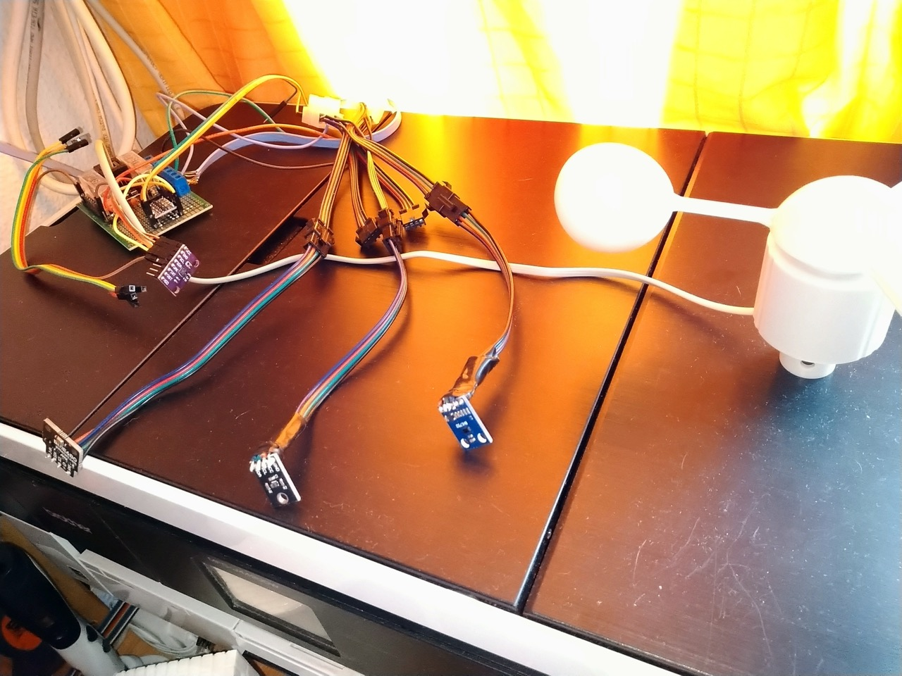
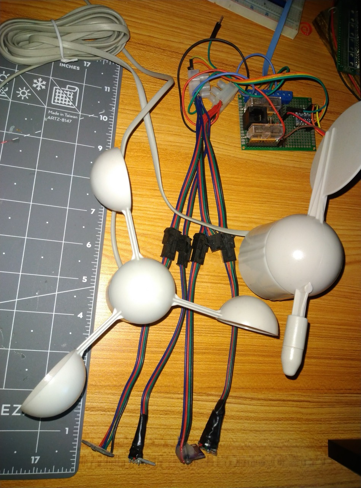
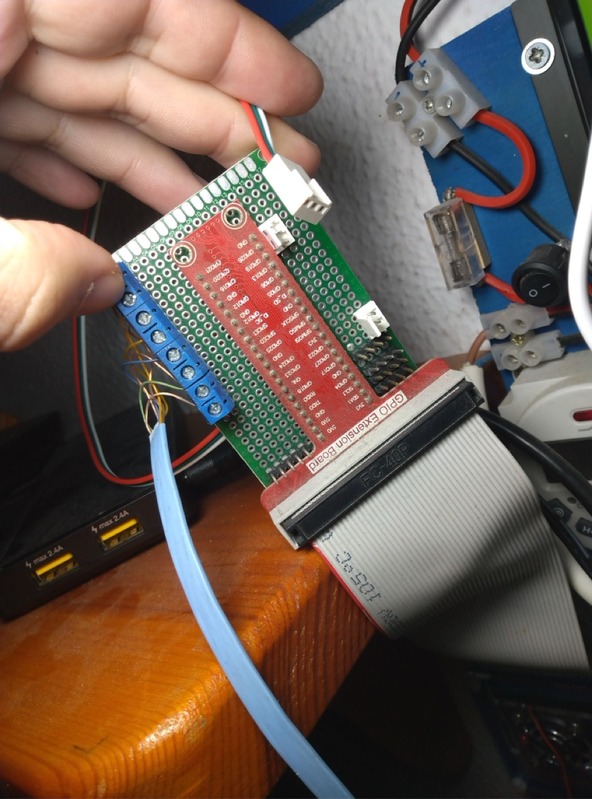
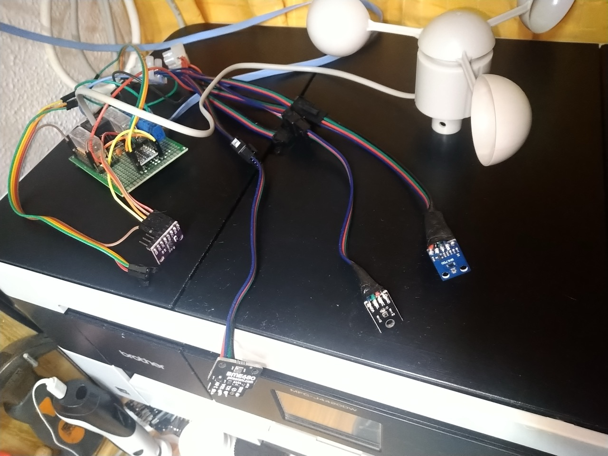

# raspberry-weather-station

Proyecto de estación meteorológica con Raspberry Pi

Este proyecto se describe para la distribución Raspberry OS stable, con otros
sistemas operativos o distribuciones pueden variar dependencias y tal vez
el código.

Es un proyecto de aprendizaje personal que comparto para quien le venga útil usarlo
como orientativo.

<p align="center">
  
  
  
  
</p>

## Hardware

El hardware con el que ha sido utilizado y probado, esto no descarta funcionar
en otro tipo de hardware similar o con pequeñas modificaciones.

- Raspberry PI 4
- Sensor bosh BME280 (Humedad, presión y temperatura)
- Sensor Bosh BME680 (Humedad, presión, temperatura y calidad del aire)
- Sensor bh1750 (Luz)
- Sensor VEML6070 (UV)
- Sensor VEML6075 (UV, UVA, UVB)
- Sensor CJMCU3935 (Rayos)
- Sensor CJMCU811 (ECO2 y TVOC)
- Sensor MQ2 (Gases)
- Anemómetro de interruptor por iman, al girar cierra contactos.
- Veleta usando encoder

## Software

- Raspbian (Debian 10)
- Python 3.7.3-1
- Postgresql 11+200+deb10u1

## Módulos python

- python3-requests
- python3-sql
- python3-postgresql
- python3-sqlalchemy
- python3-dotenv
- python3-smbus
- python3-rpi.gpio
- python3-pip
- python3-bme680

## Models

- BH1750 → Modelo que representa al sensor BH1750 para medir la cantidad de
  luz en medida **lux**
- BME280 → Modelo que representa al sensor bosh BME280 para medir
  temperatura, humedad y presión.
- BME280_humidity → Modelo que representa solo la humedad para el sensor bosh
- BME280_temperature → Modelo que representa solo la temperatura para el sensor
  bosh
- BME280_pressure → Modelo que representa solo la presión para el sensor bosh
- BME680 → Modelo que representa al sensor bosh BME680 para medir
  temperatura, humedad, presión y calidad del aire.
- BME680_humidity → Modelo que representa solo la humedad para el sensor bosh
- BME680_temperature → Modelo que representa solo la temperatura para el sensor
  bosh
- BME680_pressure → Modelo que representa solo la presión para el sensor bosh
- BME680_air_quality → Modelo que representa solo la calidad del aire para el sensor bosh
- Anemometer → Modelo que representa la lectura de velocidad del viento a
  través de un anemómetro que envía pulsos por un pin GPIO
- CJMCU3935 → Modelo para el Detector de rayos
- CJMCU811 → Modelo para el sensor de calidad del aire
- CJMCU811_eco2 → Modelo para ECO2
- CJMCU811_tvoc → Modelo para tvoc
- MQ2 → Modelo para el sensor de gases
- VEML6070 → Modelo para sensor UV
- VEML6075 → Modelo para sensor UV/UVA/UVB
- VEML6075_uv_index → Modelo para el índice UV
- VEML6075_uva → Modelo para el índice UVA
- VEML6075_uvb → Modelo para el índice UVB

## Instalación

A continuación describo los pasos para instalar que he ido usando durante el
desarrollo de la aplicación, será necesario adaptar a vuestra situación cada
paso.

Para el desarrollo trabajo en el directorio **git** dentro del **home** del
usuario por defecto: **/home/pi/git/raspberry-weather-station**

Pero sería ideal que usaras un entorno virtual python para ello, estos pasos son orientativos según como los utilizo yo.

### Crear usuario y base de datos sensor_data

```bash
sudo -u postgres createuser pi
sudo -u postgres createdb -O pi -T template1 sensor_data
```

Al crear el usuario así, tal vez necesitemos cambiar la contraseña del
usuario recién creado.

Para ello entramos al intérprete de comandos para postgres con **psql**

```bash
sudo -u postgres psql
```

Una vez dentro le pedimos cambiar la contraseña del usuario **pi**:

```postgresql
\password pi
```

### Clonar repositorio

Creamos el directorio git y entramos a él, si deseamos otro directorio no
es inconveniente mientras existan permisos adecuados para el usuario.

```bash
mkdir /home/pi/git
cd /home/pi/git
git clone https://gitlab.com/fryntiz/raspberry-weather-station.git
```

### Instalar dependencias

Instalamos las dependencias desde el gestor de paquetes:

```bash
sudo apt install python3-dotenv python3-sql python3-sqlalchemy \
    python3-psycopg2 python3-smbus python3-requests python3-rpi.gpio \
    python3-pip
```

Instalamos dependencias desde el gestor de paquetes de python3, pip3

```bash
pip3 install adafruit-circuitpython-veml6070
pip3 install bme680
pip3 install adafruit-circuitpython-veml6075
pip3 install RPi_AS3935
```

### Asignar tarea cron para ejecutarse automáticamente al iniciar la raspberry.

Podemos hacer que se inicie automáticamente al iniciar nuestra raspberry y
de esta forma asegurarnos que siempre tomará datos aunque sea reiniciada.

En el crontab se añade la línea hacia el script indicando que lo ejecute nuestro
usuario.

Adicionalmente guardo toda la salida en un log temporal dentro de **/tmp**,
esto tiene el inconveniente de que se pierde al reiniciar. Lo mantengo así
pues solo lo utilizo para depurar la salida y ver errores que pueda ir
corrigiendo. Puedes utilizar cualquier directorio para mantener permanente el
log.

Nótese que al crontab le asigno un retardo de 30 segundos para dejar tiempo a
terminar de cargar el sistema (no era necesario pero así aseguro que se
ejecuta cuando añada más servicios provocando el retraso del sistema listo)

Añadir la siguiente línea a crontab:

@reboot pi sleep 30 && python3 /home/pi/git/raspberry-weather-station/main.py >> /tmp/log-raspberry-weather-station.log 2>> /tmp/log-raspberry-weather-station.log

## Añadir nuevo sensor (añadir pasos para nuevo sensor)

Está en proceso de refactorización de código para añadir un nuevo sensor de
forma más sencilla desde un único lugar y recorrer todos los sensores de forma
dinámica (por ejemplo en un array con el nombre de su tabla para db)
